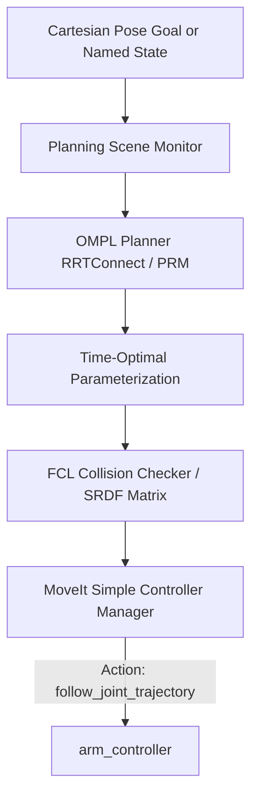

# MoveIt 2 Motion Planning & Manipulation

## 1. MoveIt 2 Architecture

MoveIt 2 operates as the high-level motion planning and manipulation pipeline. It translates Cartesian goals and joint configurations into collision-free joint trajectories executed by `arm_controller`.

---

## 2. Planning Groups & Named States

### Group: `arm`
- Kinematic Chain: Base Link `base_link` $\rightarrow$ Tip Link `tool0`
- Active Joints: `joint_1`, `joint_2`, `joint_3`, `joint_4`, `joint_5`, `joint_6`
- Kinematics Plugin: `kdl_kinematics_plugin/KDLKinematicsPlugin`
- Predefined States:
  - `home`: All joints at $0.0^\circ$ (vertical upright position).
  - `ready`: $[0^\circ, -34.4^\circ, 68.8^\circ, 0^\circ, 51.6^\circ, 0^\circ]$ (natural forward working posture).
  - `pre_grasp`: $[0^\circ, -22.9^\circ, 80.2^\circ, 0^\circ, 34.4^\circ, 0^\circ]$ (inspection pose positioned over worktable).

### Group: `gripper`
- Links: `gripper_base`, `left_finger`, `right_finger`, `gripper_tcp`
- Joints: `left_finger_joint`, `right_finger_joint`
- Predefined States:
  - `open`: Stroke at $35\text{ mm}$ ($0.035\text{ m}$)
  - `closed`: Stroke at $0\text{ mm}$ ($0.000\text{ m}$)

---

## 3. Self-Collision Matrix (SRDF)

The Semantic Robot Description Format (`auron_robot.srdf`) specifies collision pairs:
- **Adjacent links** are explicitly disabled (e.g. `base_link` $\leftrightarrow$ `base_rotation_link`, `wrist_2_link` $\leftrightarrow$ `wrist_3_link`).
- **Kinematically decoupled links** that cannot collide are disabled (e.g. `base_link` $\leftrightarrow$ `elbow_link`).
- **Self-collision checking remains active** for:
  - Upper arm $\leftrightarrow$ Gripper/Wrist
  - Forearm $\leftrightarrow$ Base
  - Gripper $\leftrightarrow$ Table / Obstacles / Environment

---

## 4. Real-Time Manipulation with MoveIt Servo

`moveit_servo.yaml` enables real-time Cartesian teleoperation with singularity avoidance and collision filtering:
- Low-pass filter coefficient: $2.0$
- Incoming command timeout: $0.2\text{ s}$
- Direct output stream to `/arm_controller/joint_trajectory`
