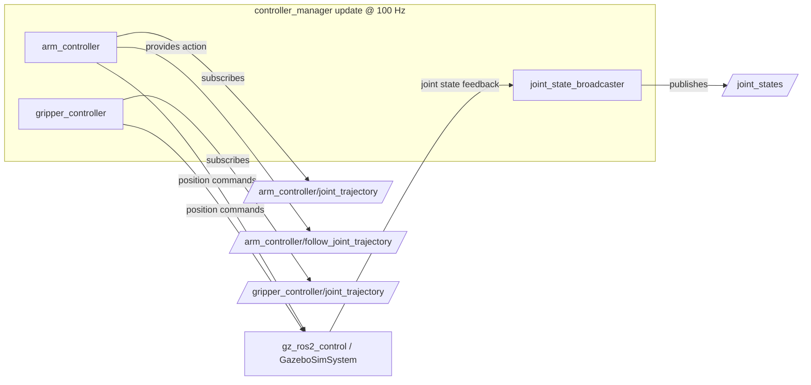

# ros2_control & Controller Architecture

## 1. Controller Manager Overview

The robot control system runs under `controller_manager` (version 4.45+ on ROS 2 Jazzy). The hardware interface connects to Gazebo Harmonic using the `gz_ros2_control/GazeboSimSystem` plugin.



---

## 2. Controller Configuration (`controllers.yaml`)

### Controller Spawners
1. **`joint_state_broadcaster`**:
   - Reads position and velocity states from simulated joints.
   - Publishes `sensor_msgs/msg/JointState` on `/joint_states` at 50 Hz.
2. **`arm_controller`**:
   - Type: `joint_trajectory_controller/JointTrajectoryController`
   - Command interface: `position`
   - State interfaces: `position`, `velocity`
   - Controlled joints: `joint_1`, `joint_2`, `joint_3`, `joint_4`, `joint_5`, `joint_6`
   - Trajectory tolerance: $0.15\text{ rad}$
   - Goal tolerance: $0.05\text{ rad}$
3. **`gripper_controller`**:
   - Type: `joint_trajectory_controller/JointTrajectoryController`
   - Controlled joints: `left_finger_joint`, `right_finger_joint`
   - Trajectory tolerance: $0.01\text{ m}$
   - Goal tolerance: $0.005\text{ m}$

---

## 3. Diagnostic & Inspection Commands

To inspect controller lifecycle states:
```bash
ros2 control list_controllers
```
Expected output:
```
joint_state_broadcaster[joint_state_broadcaster/JointStateBroadcaster] active
arm_controller[joint_trajectory_controller/JointTrajectoryController] active
gripper_controller[joint_trajectory_controller/JointTrajectoryController] active
```

To view hardware interfaces:
```bash
ros2 control list_hardware_interfaces
```
