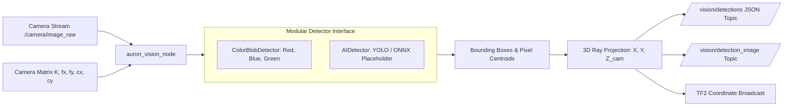

# Computer Vision & Perception Pipeline

## 1. Vision Architecture

The perception pipeline is built around a decoupled detector design:



---

## 2. 2D to 3D Projection Mathematics

Given pixel centroid $(u, v)$ from image segmentation and depth distance $Z_{\text{cam}}$:
$$X_{\text{cam}} = \frac{(u - c_x) \cdot Z_{\text{cam}}}{f_x}$$
$$Y_{\text{cam}} = \frac{(v - c_y) \cdot Z_{\text{cam}}}{f_y}$$

Where:
- $f_x, f_y$ are the camera focal lengths in pixels.
- $c_x, c_y$ are the optical center coordinates (principal point).
- $Z_{\text{cam}}$ is the estimated orthogonal distance to the worktable plane.

---

## 3. Integrating Deep Learning (YOLO / Ultralytics)

The `AIDetector` class in `auron_robot_vision/detectors.py` provides the integration hook:

```python
from ultralytics import YOLO

class AIDetector(BaseDetector):
    def __init__(self, model_path="yolov8n.pt", conf_threshold=0.5):
        self.model = YOLO(model_path)
        self.conf_threshold = conf_threshold

    def detect(self, img_bgr: np.ndarray) -> List[DetectionResult]:
        results = self.model(img_bgr, conf=self.conf_threshold)[0]
        output = []
        for box in results.boxes:
            x1, y1, x2, y2 = box.xyxy[0].tolist()
            cls_id = int(box.cls[0])
            name = results.names[cls_id]
            conf = float(box.conf[0])
            output.append(DetectionResult(
                class_name=name,
                confidence=conf,
                bbox=(int(x1), int(y1), int(x2-x1), int(y2-y1)),
                center_pixel=((x1+x2)/2.0, (y1+y2)/2.0),
                area=(x2-x1)*(y2-y1)
            ))
        return output
```

To enable the AI detector, simply pass `detector_type:=ai` to the vision launch file:
```bash
ros2 launch auron_robot_vision vision.launch.py detector_type:=ai
```
